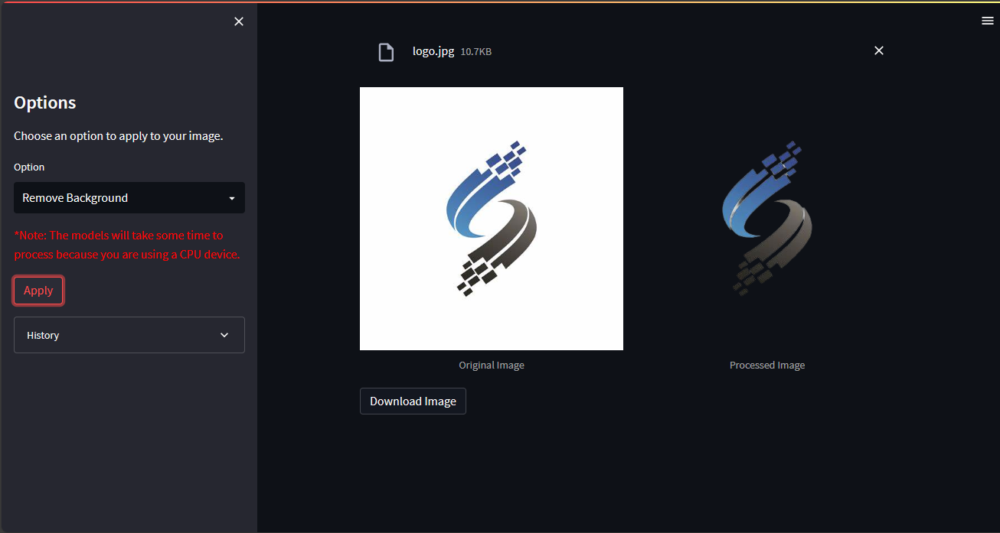

# PixelMagic: Image Processing Web App 🚀





Welcome to Pixel Magic! 🚀🤖 This is a simple web app that allows you to upload an image and apply different image processing techniques to it. You can choose between Super Resolution and Remove Background. Choose an option and upload an image to get started.

## Introduction 📜

PixelMagic is a web application that allows you to upload an image and apply different image processing techniques to it. The application is built using Python and the streamlit library.

## Features 🌟

- 🔄 **Super Resolution**: Enhance the resolution of your image.
- 📸 **Remove Background**: Remove the background from your image.

## Getting Started 🚀

To get started with PixelMagic, follow these steps:

1. Clone this repository to your local machine:

```bash
git clone https://github.com/MohamadAboud/PixelMagic
```

2. Navigate to the project directory:

```bash
cd PixelMagic
```


### Docker use: 🐳

You can run PixelMagic using Docker for a hassle-free setup. Here's how:

1. Run the Docker Compose file:

    ```bash
    docker-compose up -d
    ```

---

### Local use: 🖥️

1. Create a virtual environment:

    ```bash
    python -m venv .venv
    ```

2. Activate the virtual environment:

    ```bash
    .venv\Scripts\activate
    ```

3. Install the diffusers library:

    ```bash
    pip install git+https://github.com/huggingface/diffusers.git
    ```

4. Install the required dependencies:

    ```bash
    pip install -r requirements.txt
    ```

5. Run the project:
    
    ```bash
    streamlit run ui.py
    ```


The PixelMagic web application will be accessible at [`http://localhost:8501`](http://localhost:8501) in your browser.

That means you're all set! 🎉

## Author 🧑‍💻
PixelMagic is the brainchild of `Mohamad Aboud`. Discover more about the author and their other projects on [GitHub](https://github.com/mohamadaboud).💻😊

We hope you enjoy your PixelMagic experience! Happy exploring! 🎉🔍📊
